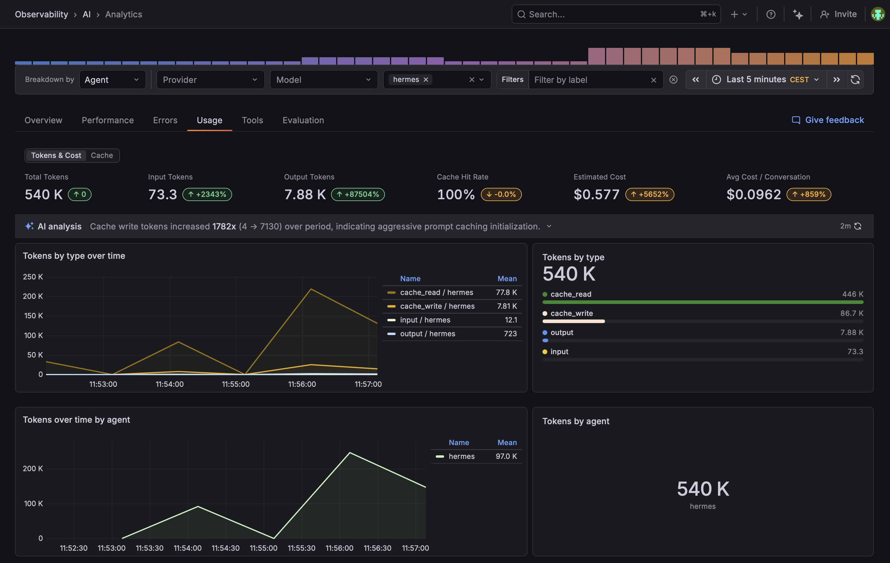

# grafana-agento11y-hermes



[Grafana Agent Observability](https://grafana.com/docs/grafana-cloud/machine-learning/ai-observability/) plugin for [Hermes Agent](https://github.com/NousResearch/hermes-agent). Records LLM calls and tool executions as generations and emits OTel traces + metrics.

## Install

### Preferred: let your agent do it

Paste this into Hermes (or any Claude / Codex / Cursor / similar agent that can fetch URLs):

```
Install and configure the Grafana Agent Observability plugin for me by following
https://raw.githubusercontent.com/alexander-akhmetov/grafana-agento11y-hermes/main/llms.txt
```

The agent will walk you through pip install, `~/.hermes/config.yaml`, and the credentials from the Agent Observability setup page. It will also explain what conversation data flows by default and how to tune it before turning anything on.

### Manual

```bash
pip install git+https://github.com/alexander-akhmetov/grafana-agento11y-hermes
```

Install into the same Python environment hermes runs from (`which hermes` to check). Then enable the plugin in `~/.hermes/config.yaml`:

```yaml
plugins:
  enabled:
    - agento11y
```

> Hermes's `plugins enable` CLI does not see pip-installed plugins yet. It only scans `~/.hermes/plugins/` and the bundled directory. Editing the YAML directly is the workaround.

### Hermes version

Use hermes v2026.6.5 or newer. That release added `api_request_id` to the API-request hooks, which is what lets the plugin attribute each generation to the API call it came from.

Older builds still work. The plugin warns once and falls back to matching on a call counter, which cannot tell apart two requests running at the same time in one session, so parallel work (Mixture-of-Agents fan-out, subagents) can attribute output to the wrong generation.

## Upgrading from hermes-plugin-sigil

The package, the module, the entry-point key and the env vars were all renamed.

1. Reinstall:

```bash
pip uninstall hermes-plugin-sigil
pip install git+https://github.com/alexander-akhmetov/grafana-agento11y-hermes
```

The uninstall is required. The new package has a different name, so pip installs it alongside the old one instead of replacing it, and both would register a plugin.

2. Change the key in `~/.hermes/config.yaml` from `sigil` to `agento11y`. The old key no longer resolves, and hermes will not load the plugin without this.

3. Rename your `SIGIL_*` env vars to `AGENTO11Y_*`, keeping the suffix (`SIGIL_ENDPOINT` becomes `AGENTO11Y_ENDPOINT`). The setup page in Configure below gives you a fresh block with the new names. The plugin still reads the old names for now and logs what to rename, so nothing breaks the moment you upgrade. The SDK itself ignores them, so this fallback goes away once the SDK is fixed.

## Configure

Everything comes from one page in your stack:

**`https://<stack>.grafana.net/a/grafana-agento11y-app/setup`**

1. Click **Create token**. The token carries `sigil:write`, `metrics:write`, `traces:write` and `logs:write`, so one token covers both channels.
2. Click **Copy as environment variables**.
3. Put the block in the environment hermes starts from.

Create the token first. If you copy the block before creating it, the token line reads `AGENTO11Y_AUTH_TOKEN=<create a token above>` and the OTLP header is a template, not an encoded value.

The block you get:

```bash
AGENTO11Y_ENDPOINT=https://agento11y-prod-eu-west-2.grafana.net
AGENTO11Y_PROTOCOL=http
AGENTO11Y_AUTH_MODE=basic
AGENTO11Y_AUTH_TENANT_ID=123456
AGENTO11Y_AUTH_TOKEN=glc_...
OTEL_EXPORTER_OTLP_ENDPOINT=https://otlp-gateway-prod-eu-west-2.grafana.net/otlp
OTEL_EXPORTER_OTLP_HEADERS='Authorization=Basic <base64 of "123456:glc_...">'
```

The lines come without `export`, so put `export ` in front of each one in a shell profile or `.envrc`. The values must be set before hermes starts.

`AGENTO11Y_*` sends generations to Agent Observability, `OTEL_*` sends traces and metrics to the OTLP gateway. Drop either group and that channel stays off.

If you do not have a Grafana Cloud account, create one at https://grafana.com/auth/sign-up/create-user/. The free tier is enough.

### If the setup page cannot do it for you

#### No Create token button

The button needs the Agento11y Admin role and a stack that Grafana provisioned for in-app token creation. Without both, create the token by hand:

1. Open **Administration -> Users and access -> Cloud access policies**.
2. Create a policy with scope `sigil:write`. Add `metrics:write`, `traces:write` and `logs:write` for the OTel channel.
3. Add a token to that policy and copy it into `AGENTO11Y_AUTH_TOKEN`.

#### OTLP endpoint row says "Not configured"

The stack has no OTLP gateway URL yet. Drop the two `OTEL_*` lines: the generations channel works on its own. For traces and metrics, add an OpenTelemetry connection to the stack, then copy the block again.

#### Copied a placeholder OTLP header

Encode the value yourself:

```bash
printf '%s' '<instance-id>:<glc_token>' | base64 | tr -d '\n'
```

The trailing newline breaks the header silently, so `tr -d '\n'` is not optional.

The other option is to delete `OTEL_EXPORTER_OTLP_HEADERS`. With the endpoint set and no header, the plugin derives `Authorization: Basic base64("$AGENTO11Y_AUTH_TENANT_ID:$AGENTO11Y_AUTH_TOKEN")` plus `X-Scope-OrgID`. That works as long as the OTLP gateway takes the same instance ID as Agent Observability.

### Optional

| Variable | Default | Description |
|---|---|---|
| `AGENTO11Y_AGENT_NAME` | `hermes` | Per-generation `gen_ai.agent.name` |
| `OTEL_SERVICE_NAME` | `hermes` | OTel resource `service.name`. Plugin defaults to `hermes` when this and `OTEL_RESOURCE_ATTRIBUTES`'s `service.name` are both unset. |
| `AGENTO11Y_CONTENT_CAPTURE_MODE` | `full` | `full` / `no_tool_content` / `metadata_only`. Plugin defaults to `full` so tool args and results are visible. The SDK's own default is `no_tool_content`, which leaves agent conversations looking empty. |
| `AGENTO11Y_DEBUG` | `false` | Verbose SDK logs |
| `AGENTO11Y_HERMES_SAMPLE_RATE` | `1.0` | Fraction of LLM and tool calls to record, `0.0` to `1.0` |
| `AGENTO11Y_HERMES_MAX_CHARS` | `12000` | Per-string truncation cap for redacted payloads |
| `AGENTO11Y_HERMES_OTEL_AUTO` | `true` | Set `false` if your application already installs a `TracerProvider` / `MeterProvider` |
| `AGENTO11Y_HERMES_AGENT_VERSION` | unset | Stamped on each generation as `effective_version`, which tracks per-version drift |

## Verify

```bash
AGENTO11Y_DEBUG=true hermes
```

In `~/.hermes/logs/agent.log` you should see:

```
grafana-agento11y-hermes: installed TracerProvider with OTLP HTTP exporter
grafana-agento11y-hermes: installed MeterProvider with OTLP HTTP exporter
grafana-agento11y-hermes: client initialized (generations=configured, otel=configured)
```

Ask hermes anything, then check **Grafana Cloud -> Observability -> AI -> Conversations**.

## License

Apache-2.0.
